# CSCI 2020U Final Project - Sketch Together

## Project Information
Sketch Together is a drawing server application where multiple rooms can be created and other users can join these rooms so that all 
the members of a room can draw on the same canvas. Some features include being able to have multiple clients in the 
same room drawing together, obtaining updates of people leaving and joining your room, and downloading the drawing.

A video demo can be found [here](https://youtu.be/9elLYiGNtck): 

Authors: Charis Chan, Beatriz Provido, Gordon Law, Jerico Robles

## How to Run
### Step 1: Obtain the repository link
>`Go to the following Github website page: ` https<nolink>://github.com/OntarioTech-CS-program/w24-csci2020u-final-project-chan-provido-robles-law

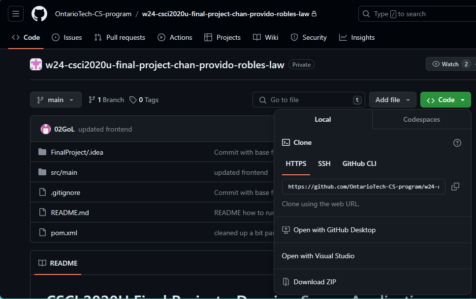

>`Click on the code dropdown to obtain and copy the https:// link to access the repository.`

### Step 2: Clone the repository locally
>`Next, open IntelliJ and click on 'Get from VCS'.`

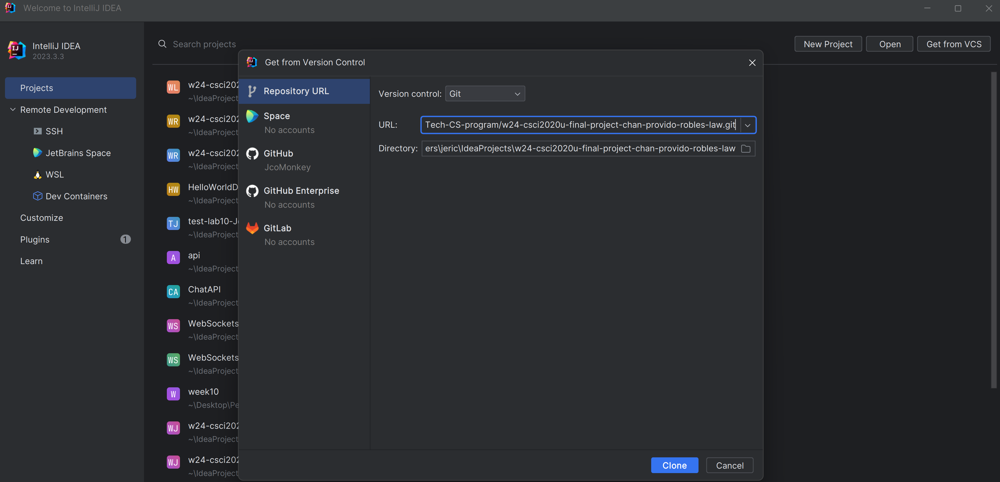

>`Then, paste the URL into the URL input box and choose the desired directory to clone your repository into. Click clone when you're satisfied.`

### Step 3: Set up the project in IntelliJ
>`Once the project opens, go to the run menu and click 'Edit Configurations'`

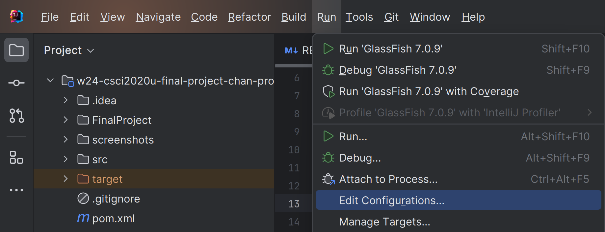

### Step 4: Set Configurations

>`Choose 'Add New Configuration' (the '+' symbol) located inside the configuration menu, and select 'GlassFish Server => Local'`

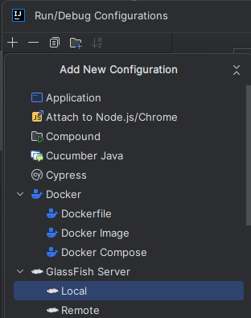

>`Change the name to 'GlassFish 7.0.9 Local'. Configure 'JRE' with JDK version 21. Fill in the 'URL' with `ws://localhost:8080/FinalProject-1.0-SNAPSHOT/ws` and 'Server Domain' with domain1 like in the screenshot below:`

>`Next, go to the 'Deployment' tab and choose 'Artifact', followed by selecting 'FinalProject:war exploded'. Click 'Apply' then 'OK'`

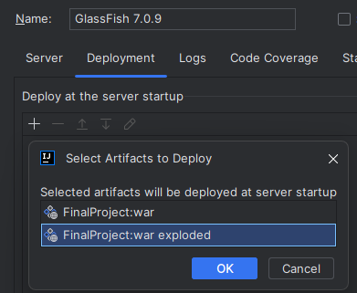

### Step 5: API Configurations
>`After setting up the websocket, we have to set up the API.
> Repeat step 3 and choose Add New Configuration' (the '+' symbol) located inside the configuration menu.`

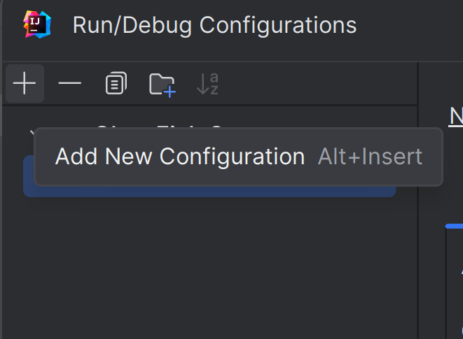

>`Select 'GlassFish Server => Remote'`

>`Change the name to 'GlassFish 7.0.9 Remote'. Fill in the 'URL' with ` http<nolink>://localhost:8080/FinalProject-1.0-SNAPSHOT/api/history

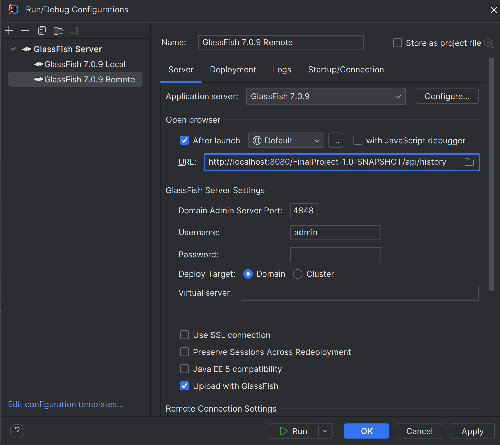

>`Go to the 'Deployment' tab and choose 'Artifact', followed by selecting 'FinalProject:war'. Click 'Apply' then 'OK'`

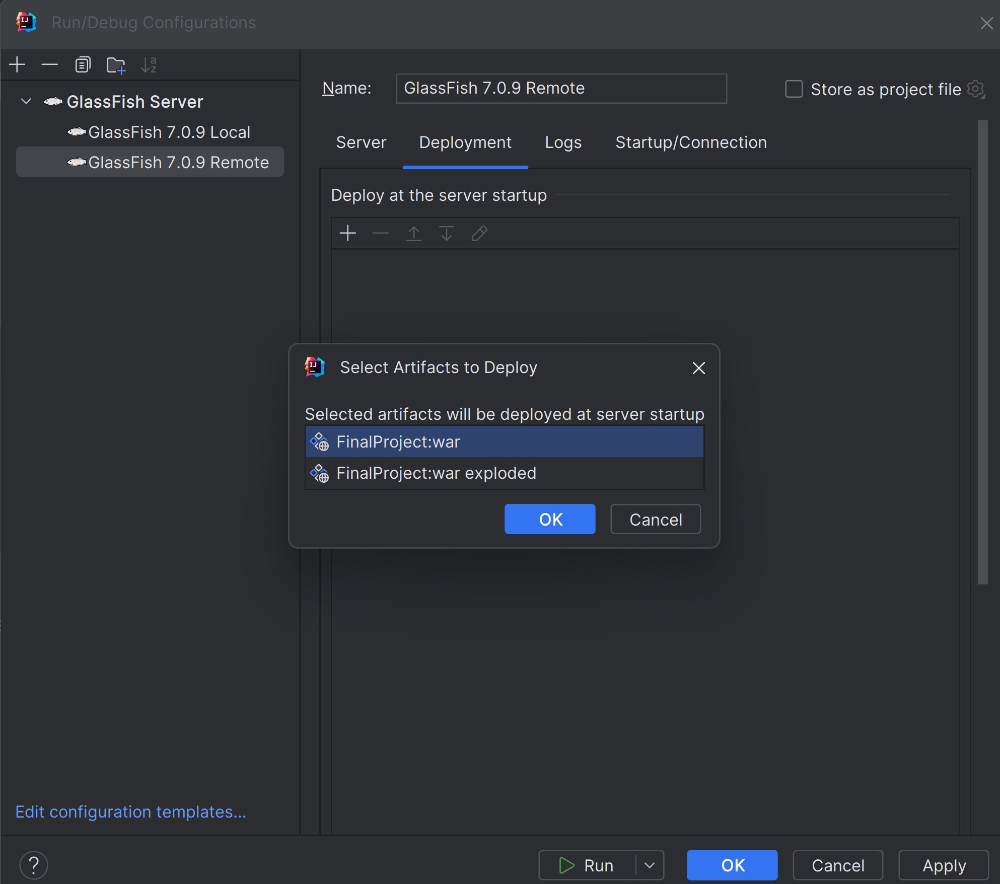

### Step 6: Deploy

> `Click on the dropdown menu to the left of the green play button at the top and select 'GlassFish 7.0.9' Local and click the play button.`

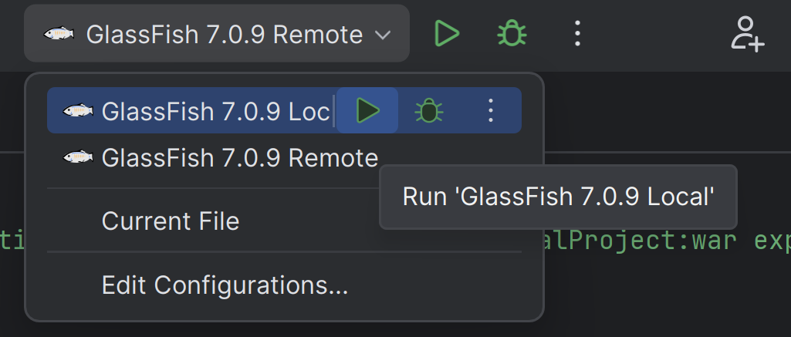

> `Next, click on the dropdown menu again and select 'GlassFish 7.0.9 Remote' and click the play button`

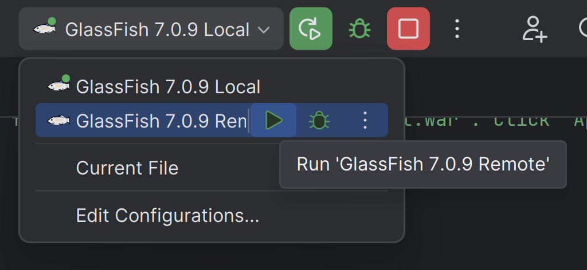

> `Lastly, right click the 'index.html' file from the file list on the left and click "Run 'index.html' "`

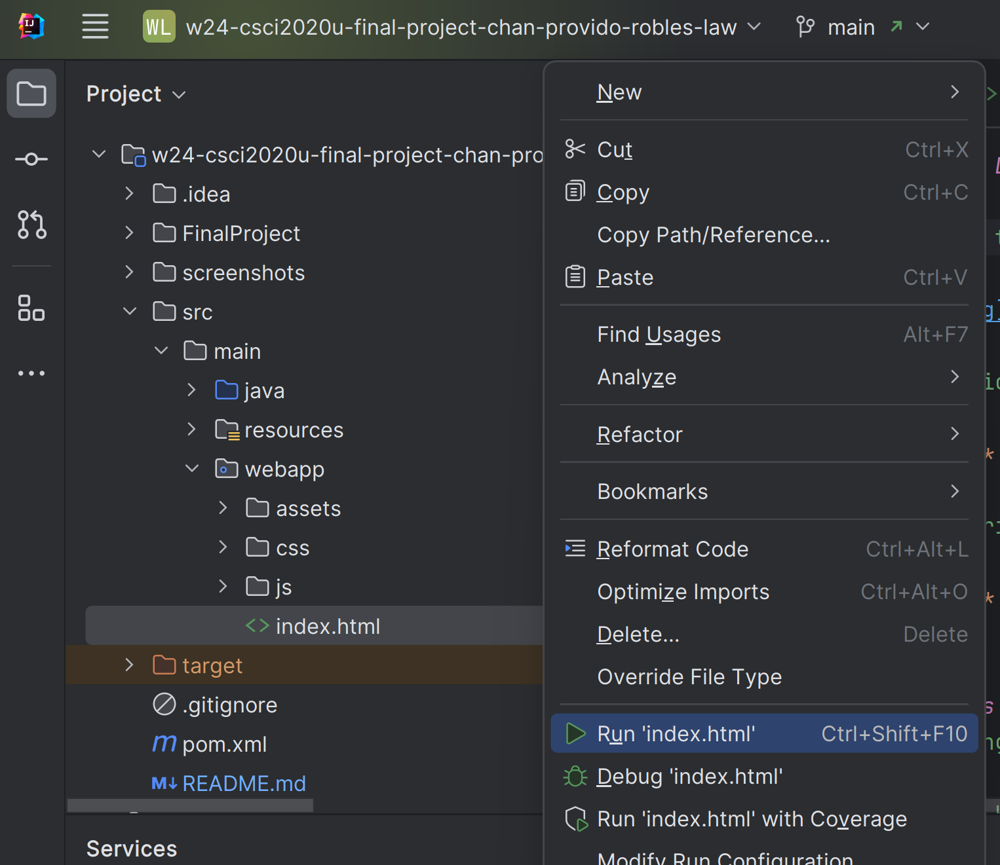

## Resources
> Downloading the image: https<nolink>://fjolt.com/article/html-canvas-save-as-image
> 
> Professor Hrim's restApi related files
> - DrawingArchiveApplication
> - DrawingArchiveResource
> - DrawingAPIHandler
> - FileReaderWriter

## Contribution
> Equal contribution